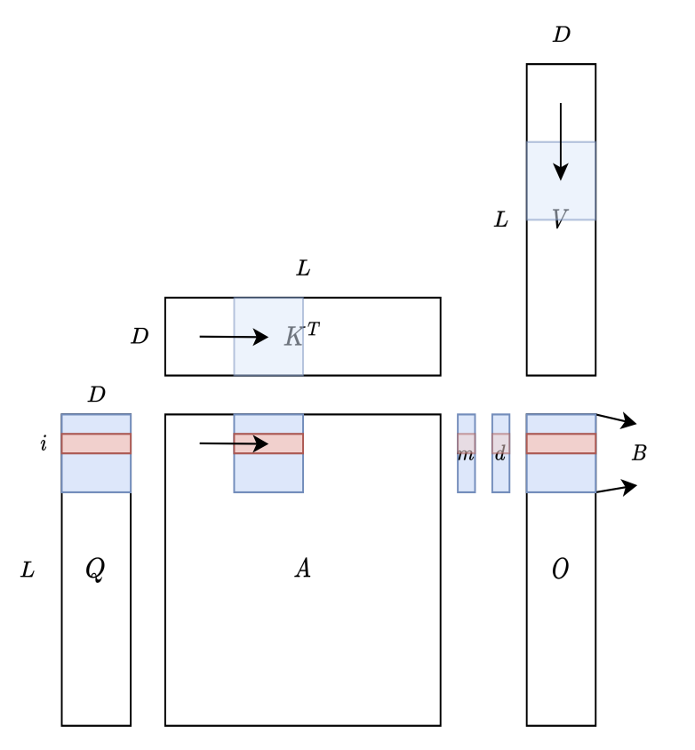
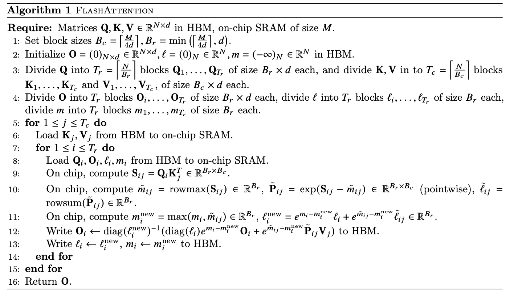

# Flash attention formula

### Original Attention

```python
def scaled_dot_product_attention(query, key, value, attn_mask=None, dropout_p=0.0,
        is_causal=False, scale=None, enable_gqa=False) -> torch.Tensor:
    L, S = query.size(-2), key.size(-2)
    scale_factor = 1 / math.sqrt(query.size(-1)) if scale is None else scale
    attn_bias = torch.zeros(L, S, dtype=query.dtype)
    if is_causal:
        assert attn_mask is None
        temp_mask = torch.ones(L, S, dtype=torch.bool).tril(diagonal=0)
        attn_bias.masked_fill_(temp_mask.logical_not(), float("-inf"))
        attn_bias.to(query.dtype)

    if attn_mask is not None:
        if attn_mask.dtype == torch.bool:
            attn_bias.masked_fill_(attn_mask.logical_not(), float("-inf"))
        else:
            attn_bias += attn_mask

    if enable_gqa:
        key = key.repeat_interleave(query.size(-3)//key.size(-3), -3)
        value = value.repeat_interleave(query.size(-3)//value.size(-3), -3)

    attn_weight = query @ key.transpose(-2, -1) * scale_factor
    attn_weight += attn_bias
    attn_weight = torch.softmax(attn_weight, dim=-1)
    attn_weight = torch.dropout(attn_weight, dropout_p, train=True)
    return attn_weight @ value
```

$S = QK^T$, $P = softmax(X)$, $O = PV$

Standard attention implementations materialize the matrices S and P to HBM, which takes $𝑂(𝑁_2)$ memory. 

As some or most of the operations are memory-bound (e.g., softmax), the large number of memory accesses translates to slow wall-clock time.

### Online softmax

**safe softmax**

$\frac{e^{x_i-m}}{\sum_{j=1}^{N}e^{x_j-m}}$

1. for $i\leftarrow 1, N$ 
    - $m_i = max(m_{i-1}, x_i)$
2. for $i \leftarrow 1, N$ 
    - $d_i = d_{i-1} + e^{x_i-m_N}$
3. for $i \leftarrow 1, N$ 
    - $a_i = \frac{e^{x_i-m_N}}{d_N}$

**online softmax**

$d^{\prime}_{i} = \sum_{j=1}^{j} e^{x_j-m_i} = (\sum_{j=1}^{j-1} e^{x_j-m_i}) + e^{x_i-m_i} \\ = (\sum_{j=1}^{j-1} e^{x_j-m_{i-1}})e^{m_{i-1}-m_i} + e^{x_i-m_i}\\=d^{\prime}_{i-1}e^{m_{i-1}-m_i} + e^{x_i-m_i}$

1. for $i\leftarrow 1, N$ 
    - $m_i = max(m_{i-1}, x_i)$
    - $d^{\prime}_i = d^{\prime}_{i-1}e^{m_{i-1}-m_i} + e^{x_i-m_i}$
2. for $i\leftarrow 1, N$ 
    - $a_i = \frac{e^{x_i-m_N}}{d^{\prime}_N}$

### Flash Attention

**Multi-pass self-attention**

inputs: $Q[k, :], K^T[:, i], V[i, :]$

output: $O[k, :]$

1. for $i\leftarrow 1, N$ 
    
    $x_i = Q[k, :] K^T[:, i]$
    
    $m_i = max(m_{i-1}, x_i)$
    
    $d^{\prime}_i = d^{\prime}_{i-1}e^{m_{i-1}-m_i} + e^{x_i-m_i}$
    
2. for $i\leftarrow 1, N$ 
    
    $a_i = \frac{e^{x_i-m_N}}{d^{\prime}_N}$
    
    $o_i = o_{i-1} + a_i V[i, :]$
    
3. $O[k, :] = o_N$

$o_i = \sum_{j=1}^{i} (\frac{e^{x_j-m_N}}{d^{\prime}_N}V[j, :])$

let $o_i^{\prime} = \sum_{j=1}^{i} \frac{e^{x_j-m_i}}{d^{\prime}_i}V[j, :] \\= (\sum_{j=1}^{i-1} \frac{e^{x_j-m_i}}{d^{\prime}_i}V[j, :]) + \frac{e^{x_i-m_i}}{d^{\prime}_i}V[j, :] \\= (\sum_{j=1}^{i-1} \frac{e^{x_j-m_{i-1}}}{d^{\prime}_{i-1}}\frac{e^{x_j-m_i}}{e^{x_j-m_{i-1}}}\frac{d^{\prime}_{i-1}}{d^{\prime}_{i}}V[j, :] ) + \frac{e^{x_i-m_i}}{d^{\prime}_i}V[j, :] \\= 
(\sum_{j=1}^{i-1} \frac{e^{x_j-m_{i-1}}}{d^{\prime}_{i-1}}V[j, :] ) \frac{d^{\prime}_{i-1}}{d^{\prime}_{i}}e^{m_{i-1}-m_i}+ \frac{e^{x_i-m_i}}{d^{\prime}_i}V[j, :] \\=o_{i-1}^{\prime}\frac{d^{\prime}_{i-1}e^{m_{i-1}-m_i}}{d^{\prime}_{i}}+ \frac{e^{x_i-m_i}}{d^{\prime}_i}V[j, :]$ 

**Flash attention** 

1. for $i\leftarrow 1, N$ 
    
    $x_i = Q[k, :] K^T[:, i]$
    
    $m_i = max(m_{i-1}, x_i)$
    
    $d^{\prime}_i = d^{\prime}_{i-1}e^{m_{i-1}-m_i} + e^{x_i-m_i}$
    
    $o^{\prime}_{i} = o^{\prime}_{i-1} \frac{d^{\prime}{i-1}e^{m{i-1}-m_i}}{d^{\prime}_{i}}+ \frac{e^{x_i-m_i}}{d^{\prime}_i}V[j, :]$ 
    
2. $O[k, :] = o_N$

**Flash attention w/ Tiling**

1. for $i \leftarrow 1, \#tiles$ 
    
    $x_i = Q[k,:]K^T[:,(i-1)b:ib]$
    
    $m_i^{(local)} = max_{j=1}^b(x_i[j])$
    
    $m_i = max(m_{i-1}, m_i^{(local)})$
    
    $d_{i}^{\prime} = d_{i-1}^{\prime} e^{m_{i-1}-m_i} + \sum_{j=1}^{b}e^{x_i[j]-m_i}$
    
    $o^{\prime}_{i} = o^{\prime}_{i-1} \frac{d^{\prime}{i-1}e^{m{i-1}-m_i}}{d^{\prime}_{i}}+ \sum_{j=1}^{b} \frac{e^{x_i[j]-m_i}}{d^{\prime}_i}V[j+(i-1)b, :]$ 
    
2. $O[k, :] = o^{\prime}_{N/b}$



The overall SRAM memory footprint depends only on B and D and is not related to L.

